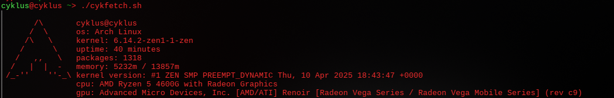

# cykfetch
an attempt to make a neofetch version without using external libraries

## license
i don't give a fuck, it's licensed under unlicense, do whatever you want.

--------------------------------------------------------------------------
  
*this is how it looks like. it's arch linux only for now, i would maintain it but now taking care of my cats is enough.*

## speed comparison (tested on amd ryzen 5 4600g)

| program     | executed (ms) | user time (ms) | sys time (ms) |
|-------------|---------------|---------------|---------------|
| cykfetch     |  53.18        |  27.48         |  35.18        |
| neofetch     | 391.57        | 190.42         | 196.88        |
| cykfetch (C) |  17.78        |   6.74         |  12.86        |

## features
- arch linux only (for now)
- no external libraries
- minimal design (i stole the ascii from pfetch lol)

## instructions
1. download the script
2. make it executable: `chmod +x /path/to/cykfetch.sh`
3. run the script: `./cykfetch.sh`
4. enjoy

## instructions for C
1. download the C file and move it into a folder
2. open a terminal and navigate to the folder where you placed `cykfetch.c`.
3. install the necessary development tools if you haven't already, using the following command:
`sudo pacman -S base-devel`
4. compile the C file using GCC:
`gcc -o cykfetch /path/to/cykfetch.c`
5. make the binary file executable:
`chmod +x ./cykfetch`
6. run the script
7. enjoy

## instructions for Lua
1. idk
