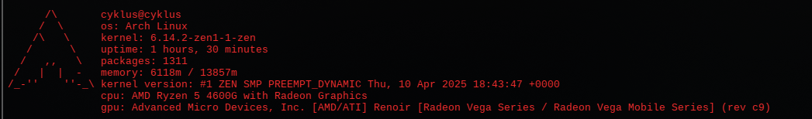

# cykfetch
an attempt to make a neofetch version without using external libraries

  
*this is how it looks like. it's arch linux only for now, i would maintain it but now taking care of my cats is enough.*

## speed comparison (tested on amd ryzen 5 4600g)

| program   | executed (ms) | user time (ms) | sys time (ms) |
|-----------|---------------|----------------|---------------|
| cykfetch  | 53.18         | 27.48          | 35.18         |
| neofetch  | 391.57        | 190.42         | 196.88        |

## features
- arch linux only (for now)
- no external libraries
- minimal design
